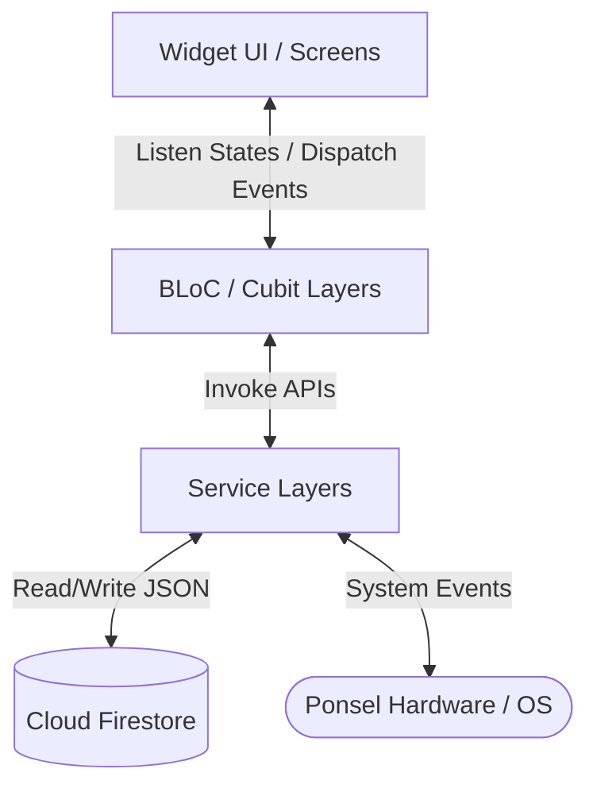
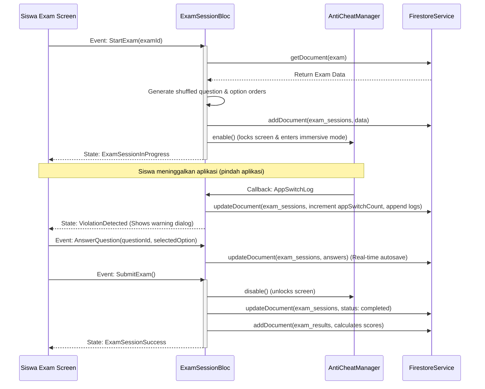

# Arsitektur Aplikasi & State Management — CBT App

CBT App dirancang dengan memisahkan kode berdasarkan arsitektur **BLoC (Business Logic Component)** dan **Cubit** sebagai pengatur status (state management) utama. Pendekatan ini menjamin pemisahan yang bersih antara antarmuka pengguna (UI), logika bisnis (BLoC/Cubit), dan sumber data (Services).

---

## Gambaran Arsitektur

1.  **Presentation Layer (UI)**: Widget Flutter deklaratif yang membaca state dan mengirimkan event/aksi. Menggunakan `BlocProvider`, `BlocBuilder`, `BlocListener`, dan `context.read()`.
2.  **Business Logic Layer (BLoC/Cubit)**: Mengelola state aplikasi berdasarkan input dari UI atau aliran (stream) data dari layanan.
3.  **Data & Service Layer**: Berisi kelas layanan yang membungkus SDK Firebase dan platform channel OS native.

---

## 1. Pembagian Peran State Management (BLoC & Cubit)

Modul logika bisnis dibagi berdasarkan peran aktor pengguna (Admin, Guru, Siswa) dan Otentikasi umum:

### A. Otentikasi Umum (Auth)
*   **`AuthBloc`**
    *   **Tanggung Jawab**: Mendengarkan perubahan status login dari Firebase Auth secara real-time. Mengarahkan rute awal aplikasi berdasarkan peran pengguna (Admin, Guru, Siswa).
    *   **State**: `Uninitialized`, `Authenticated(UserModel)`, `Unauthenticated`, `AuthLoading`.
    *   **Event**: `AppStarted`, `LoggedIn`, `LoggedOut`.

### B. Modul Admin
Mengelola data pengguna dan ringkasan sistem secara global.
*   **`AdminDashboardCubit`**: Mengambil statistik cepat untuk dashboard utama admin.
*   **`AdminStatisticsCubit`**: Menyusun bagan statistik pendaftaran pengguna dan aktivitas ujian.
*   **`UserManagementCubit`**: Mengurus pengambilan daftar semua pengguna, pencarian, dan penonaktifan akun.
*   **`CreateUserCubit`**: Menangani logika pendaftaran akun baru dengan validasi form.
*   **`EditUserCubit`**: Mengubah informasi profil pengguna yang ada.

### C. Modul Guru
Mengatur pembuatan soal, ujian, penilaian, dan pemantauan waktu nyata (real-time).
*   **`GuruDashboardCubit`**: Menyajikan ringkasan ujian aktif dan riwayat aktivitas guru.
*   **`ExamListCubit`**: Menampilkan daftar ujian yang dibuat oleh guru tertentu.
*   **`CreateExamCubit` & `EditExamCubit`**: Menangani form pembuatan dan perubahan konfigurasi ujian.
*   **`AddQuestionCubit`**: Mengelola soal-soal di dalam ujian tertentu (tambah, edit, hapus, dan pengurutan ulang/reorder).
*   **`QuestionBankCubit`**: Logika impor/ekspor soal dari database bank soal global.
*   **`ExamResultsCubit`**: Rekapitulasi daftar nilai seluruh siswa yang mengikuti ujian tertentu.
*   **`StudentResultDetailCubit`**: Detail jawaban siswa per butir soal, termasuk log waktu cheat/app-switch.
*   **`EssayGradingListCubit` & `EssayGradingDetailCubit`**: Antarmuka penilaian manual untuk jawaban essay siswa oleh guru.
*   **`MonitoringCubit`**: Memantau pengerjaan siswa secara real-time saat ujian sedang berlangsung melalui `streamCollection` dari Firestore untuk menampilkan status siswa (sedang mengerjakan, selesai, pelanggaran switch app).

### D. Modul Siswa
Fokus pada keikutsertaan ujian, pengisian jawaban, dan riwayat nilai.
*   **`JoinExamCubit`**: Memvalidasi kode token ujian siswa sebelum diizinkan masuk.
*   **`ExamListCubit`**: Mengambil daftar ujian yang sedang dibuka untuk dikerjakan.
*   **`SiswaProfileCubit`**: Mengelola pembaruan sandi & informasi siswa.
*   **`ExamHistoryCubit`**: Riwayat ujian yang pernah diselesaikan siswa beserta nilainya.
*   **`ExamSessionBloc`**: Jantung pengerjaan ujian siswa. BLoC ini mengelola state pengerjaan secara detail:
    1.  Mempersiapkan pengacakan soal (`questionOrder`) & opsi PG (`optionOrders`).
    2.  Mengelola penyimpanan jawaban sementara siswa secara real-time ke Firestore (lokal & remote) untuk ketahanan jaringan (offline-handling).
    3.  Menjalankan timer hitung mundur.
    4.  Mendengarkan event pelanggaran `app_switch` dari `AntiCheatManager`.
    5.  Menangani penyerahan otomatis (`auto-submit`) saat waktu habis.

---

## 2. Alur Interaksi Data (Data Flow)

### Contoh: Alur Pengerjaan Ujian Siswa (Exam Session Flow)

---

## 3. Ketahanan Jaringan & Offline Handling
Aplikasi menerapkan strategi caching Firestore dan sinkronisasi otomatis:
1.  **Firestore Offline Persistence**: Diaktifkan secara bawaan oleh SDK Firestore. Saat siswa kehilangan koneksi internet (offline), mutasi jawaban tetap ditulis ke database lokal SQLite yang dikelola Firestore SDK.
2.  **Automated Resync**: Begitu perangkat mendapatkan koneksi internet kembali, SDK Firestore secara otomatis mengirimkan (sync) antrean mutasi jawaban ke server tanpa perlu memuat ulang aplikasi atau merusak sesi ujian yang sedang berjalan.
3.  **Connection Banner**: Banner pemberitahuan visual `"Koneksi Terputus - Jawaban Disimpan di Memori Lokal"` ditampilkan di bagian atas layar siswa selama ujian jika koneksi internet terputus (Issue #50).
